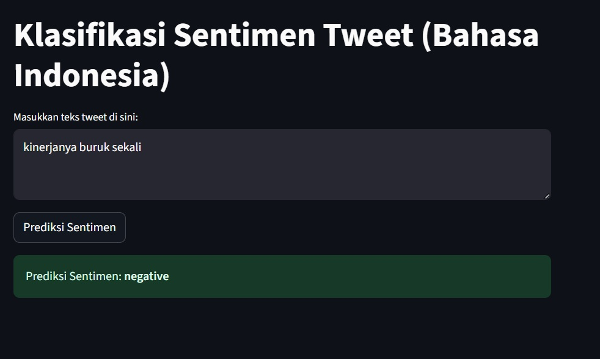

# Sentiment Classification (Bahasa Indonesia)

Klasifikasi sentimen (Positif vs Negatif) dari tweet berbahasa Indonesia menggunakan Naive Bayes + TF-IDF.

##Dataset Training:
Lestari, A.R.T., Perdana, R.S., & Fauzi, M.A. (2017). Analisis Sentimen Tentang Opini Pilkada DKI 2017 Pada Dokumen Twitter Berbahasa Indonesia Menggunakan Naïve Bayes dan Pembobotan Emoji. Jurnal Pengembangan Teknologi Informasi Dan Ilmu Komputer, 1(12), 1718-1724. Diambil dari http://j-ptiik.ub.ac.id/index.php/j-ptiik/article/view/627


## Fitur
- Input teks untuk prediksi sentimen
- Aplikasi web sederhana pakai Streamlit

## Cara Menjalankan
```bash
streamlit run app.py
```

## Visulisasi Aplikasi


